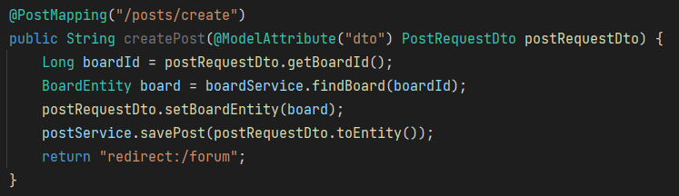

# 1차 프로젝트

- 여러 개의 각각 다른 주제를 가진 게시판
- 게시판 내부에는 여러 개의 게시글이 있고 게시글마다 댓글을 달거나 삭제 가능
- 게시판, 게시글, 댓글이 모두 생성과 수정이 가능하도록 개발하고,
  관계에 따라 게시글을 삭제하면 댓글이 모두 삭제, 게시판을 삭제하면 여기에 속한 게시글과 댓글이 모두 삭제되도록 개발하려고 했습니다.

# 프로젝트 기획, ERD 작성

### 어떤 게시판을 만들까?

- 일상생활 공유 게시판 - 레딧의 고양이 게시판을 참고
- **붉은 글씨는 MVP에서 제외**
- 게시판 - Board
    - 이미지나 짧은 동영상, 제목, 내용이 포함된 게시글들의 리스트
    - 좋아요와 싫어요는 따로따로가 아니라 각각의 합으로 표시
    - 각 게시글마다 댓글의 개수를 표시
    - 생성 버튼을 통해 게시글 생성 페이지로 이동
    - 게시글 작성자인 경우 게시글에 수정과 삭제 버튼 사용 가능
- 게시글 - Post
    - 게시글을 클릭하여 이동
    - 수정 버튼 클릭 시 생성 페이지로 이동하여 수정
    - 게시글 작성자는 삭제 버튼으로 게시글 삭제
    - 하단에서 댓글 조회 가능
- 댓글 - Comment
    - 댓글 등록, 조회 - 게시글 작성자가 아니어도 가능
    - 댓글 수정, 삭제 - 댓글의 작성자만 가능하도록
    - 댓글이 달린 게시글에 종속적, 게시글이 삭제되면 해당 게시글에 달린 댓글도 삭제되어야 한다.

### ERD 초안

**게시판**

- 게시판 주제
- 게시글 id
- 작성자 id

**게시글**

- 게시글 id
- 게시글 제목
- 게시글 내용
- 작성자 id
- 작성 일자
- 댓글 작성자

**댓글**

- 작성자 id
- 댓글 내용
- 작성 일자
- 작성된 위치

**사용자**

- id
- 별명

---

**User**

- 게시판을 사용하고 있는 유저의 정보를 저장한다.
- user_id는 유저를 구분하는 PK이며 nickname은 유저의 별명을 의미한다.

**Board**

- 게시판으로 게시글의 post_id를 참조해 게시글들을 일정한 개수 나열하도록 구현할 계획
- user_id를 참조하여 Post 게시글마다 해당하는 유저의 별명을 표시

**Post**

- 게시글에는 제목과 내용이 존재하며 게시글을 작성한 유저의 별명을 User의 user_id를 통해 표시
- 게시글이 작성된 시간이 존재
- Comment의 commnet_id를 참조하여 게시글에 존재하는 댓글을 출력한다.
- 게시글의 내용은 제한을 두지 않기 위해 text로 설정했다.

**Comment**

- 댓글에 대한 정보를 저장한다.
- 댓글의 작성자, 내용과 작성일시를 포함한다.
- Post의 post_id를 가지고 있어 post가 삭제되면 해당하는 post_id를 가진 Comment 또한 삭제되도록 구현해야 한다.

### 와이어프레임

* * *

## 트러블슈팅

- 문제상황:
  - 업데이트 시 form 태그에서 put 메소드가 적용이 안되는 상황 발생
  - 게시글 생성 시 form을 통해 게시글이 속하게 되는 게시판 엔티티를 전송하지 못하는 문제
- 원인:
  - form은 get과 post는 지원하지만 put과 delete 메소드는 지원하지 않았습니다.
  - input을 통해 엔티티에 대한 정보를 하나하나 적을 경우 코드가 복잡해지며 유저 편의성이 나빠집니다.
- 해결방법:
  - form 태그 내에 다음과 같이 hidden input을 생성하여 전송, thymeleaf에서는 `th:method` 가 이러한 input 태그를 자동으로 생성해줘 편하게 진행할 수 있었습니다.
  - 일시적 해결방법: form에서 게시글을 생성하고자 하는 게시판을 선택하면, 해당 게시판에 대한 id 값을 넘겨줍니다. 이후 컨트롤러에서는 전달받은 게시판 id 값을 통해 서비스 단에 id 값이 일치하는 게시판에 대한 엔티티 정보를 요청하고 이를 dto에 넣어 게시글을 저장하는 방식으로 해결했습니다.
    하지만 dto에 getter를 사용하기에 좋은 해결법이 아니라고 생각되며 추후 더 나은 방법으로 수정해야합니다.

## 회고

- 엔티티를 설정하는 부분에서 어려움을 겪었습니다.
  ERD를 통해 데이터베이스를 설계하는 것은 간단했지만 코드로 이를 적는 것이 어려웠습니다.
- 새롭게 데이터를 입력할 때 외래키의 설정으로 인해 어려움을 겪었습니다.
  게시글 저장 시 게시판의 엔티티를 저장해야 했는데, form에서 이를 어떻게 받아올지 곤란했었습니다.
  완벽한 해결법은 아니지만, form에서 게시판의 id를 받아오고 컨트롤러에서 서비스를 호출해 게시글을 삽입하고자 하는 게시판의 엔티티를 요청해 이를 dto에 삽입하는 방식으로 해결했습니다.
  하지만 dto에서 getter를 사용하기 때문에 더 좋은 방법을 찾아보거나 엔티티의 설정을 수정해야할 것 같습니다.
- git을 통한 버전관리의 중요성을 익힐 수 있었습니다.
  기능을 개발하다 이전 버전에서는 작동했던 기능이 갑자기 안되는 경우 git을 통해 코드를 비교해 문제를 수정하거나 롤백하여 처음부터 다시 코드를 짜는 데 많이 사용했습니다.
  프로젝트를 시작하고 초반에 에러가 발생할 때마다 ‘아, 커밋하고 작업할걸!’ 같은 생각을 많이 했고, 후반부터는 아주 사소한 기능이라도 커밋하고 보는 습관이 생긴 것 같습니다.
- 이번 프로젝트는 spring을 처음 사용하는 만큼 어려운 점도 많았지만 무엇보다 많이 배워갈 수 있었던 시간이었습니다.
  프로젝트 기간이 아닐 때 코치님의 강의를 보면서 듣고 코드를 치는 것 보다 실제로 개발을 진행하면서 에러를 겪고 이를 수정하고, 문제를 해결하기 위해 고민하면서 스프링의 사용법에 대해 많이 익숙해질 수 있었습니다.
  오피스 아워와 코드 리뷰를 통해 100퍼센트 동일하지는 않겠지만 팀으로서 코드 개발을 한다면 어떤 방식으로 이뤄지는 지에 대해 알 수 있어 좋았습니다.
  어떻게 코드를 정리해야 할지, 왜 여기서 이것을 쓰면 안되는지 등 직접 팀원 한 명 한 명 코드를 보시면서 알려주셨기 때문에 쉽게 이해가 됐고 많이 배울 수 있었습니다.
- 하지만 동시에 시간이 조금만 더 있었다면 이런 것도 할 수 있지 않았을까 같은 아쉬움도 많이 있습니다.
  현재 상태에서 제 코드는 CRUD 후 같은 페이지를 새롭게 로드한 데이터와 보여주는 것이 안되어 메인 페이지로 리다이렉트하도록 설정했습니다. 또 위에서도 언급했지만 dto에서 getter를 사용한 외래키 엔티티 설정은 좋지 못한 코드지만, 이를 수정하기 위한 원인 파악과 엔티티 수정을 하지 못해 아쉬웠습니다.

### 시연 이미지 링크
[노션](https://www.notion.so/20fed1c6be7f414590e911d8e6ea3e01?v=4191fa30464549cb9dbe92fdddc8618b&p=ad2e3d4dff7d48449236e682f45c561d&pm=s, "personal notion")