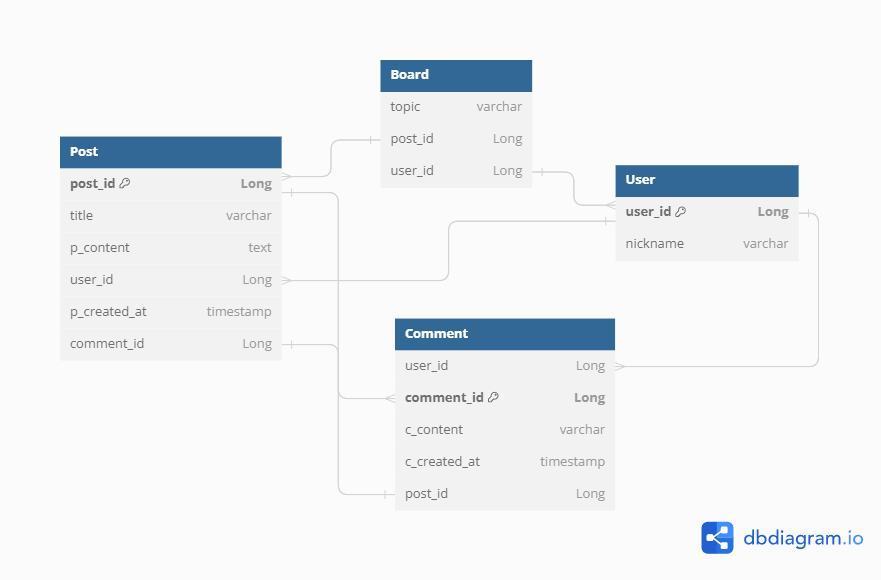
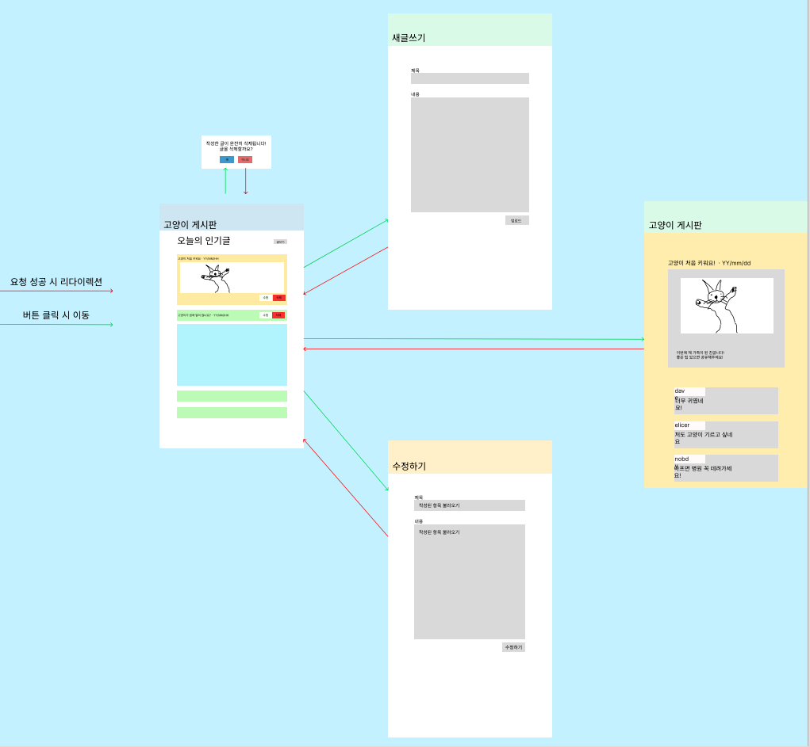

# 1차 프로젝트

작성 일시: 2024년 1월 9일
1차 프로젝트 1주차 둘째날

# 프로젝트 기획, ERD 작성

### 어떤 게시판을 만들까?

- 일상생활 공유 게시판 - 레딧의 고양이 게시판을 참고
- **붉은 글씨는 MVP에서 제외**
- 게시판 - Board
    - 이미지나 짧은 동영상, 제목, 내용이 포함된 게시글들의 리스트
    - 좋아요와 싫어요는 따로따로가 아니라 각각의 합으로 표시
    - 각 게시글마다 댓글의 개수를 표시
    - 생성 버튼을 통해 게시글 생성 페이지로 이동
    - 게시글 작성자인 경우 게시글에 수정과 삭제 버튼 사용 가능
- 게시글 - Post
    - 게시글을 클릭하여 이동
    - 수정 버튼 클릭 시 생성 페이지로 이동하여 수정
    - 게시글 작성자는 삭제 버튼으로 게시글 삭제
    - 하단에서 댓글 조회 가능
- 댓글 - Comment
    - 댓글 등록, 조회 - 게시글 작성자가 아니어도 가능
    - 댓글 수정, 삭제 - 댓글의 작성자만 가능하도록
    - 댓글이 달린 게시글에 종속적, 게시글이 삭제되면 해당 게시글에 달린 댓글도 삭제되어야 한다.

### ERD 초안

**게시판**

- 게시판 주제
- 게시글 id
- 작성자 id

**게시글**

- 게시글 id
- 게시글 제목
- 게시글 내용
- 작성자 id
- 작성 일자
- 댓글 작성자

**댓글**

- 작성자 id
- 댓글 내용
- 작성 일자
- 작성된 위치

**사용자**

- id
- 별명

---

**User**

- 게시판을 사용하고 있는 유저의 정보를 저장한다.
- user_id는 유저를 구분하는 PK이며 nickname은 유저의 별명을 의미한다.

**Board**

- 게시판으로 게시글의 post_id를 참조해 게시글들을 일정한 개수 나열하도록 구현할 계획
- user_id를 참조하여 Post 게시글마다 해당하는 유저의 별명을 표시

**Post**

- 게시글에는 제목과 내용이 존재하며 게시글을 작성한 유저의 별명을 User의 user_id를 통해 표시
- 게시글이 작성된 시간이 존재
- Comment의 commnet_id를 참조하여 게시글에 존재하는 댓글을 출력한다.
- 게시글의 내용은 제한을 두지 않기 위해 text로 설정했다.

**Comment**

- 댓글에 대한 정보를 저장한다.
- 댓글의 작성자, 내용과 작성일시를 포함한다.
- Post의 post_id를 가지고 있어 post가 삭제되면 해당하는 post_id를 가진 Comment 또한 삭제되도록 구현해야 한다.

### 와이어프레임

